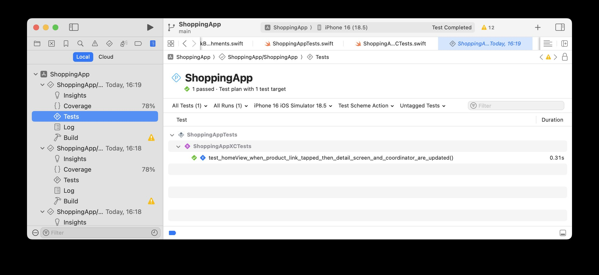
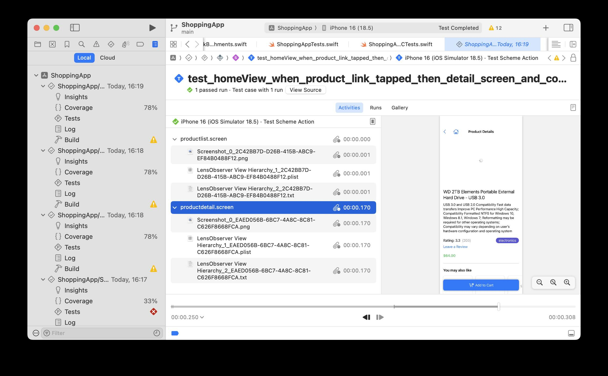
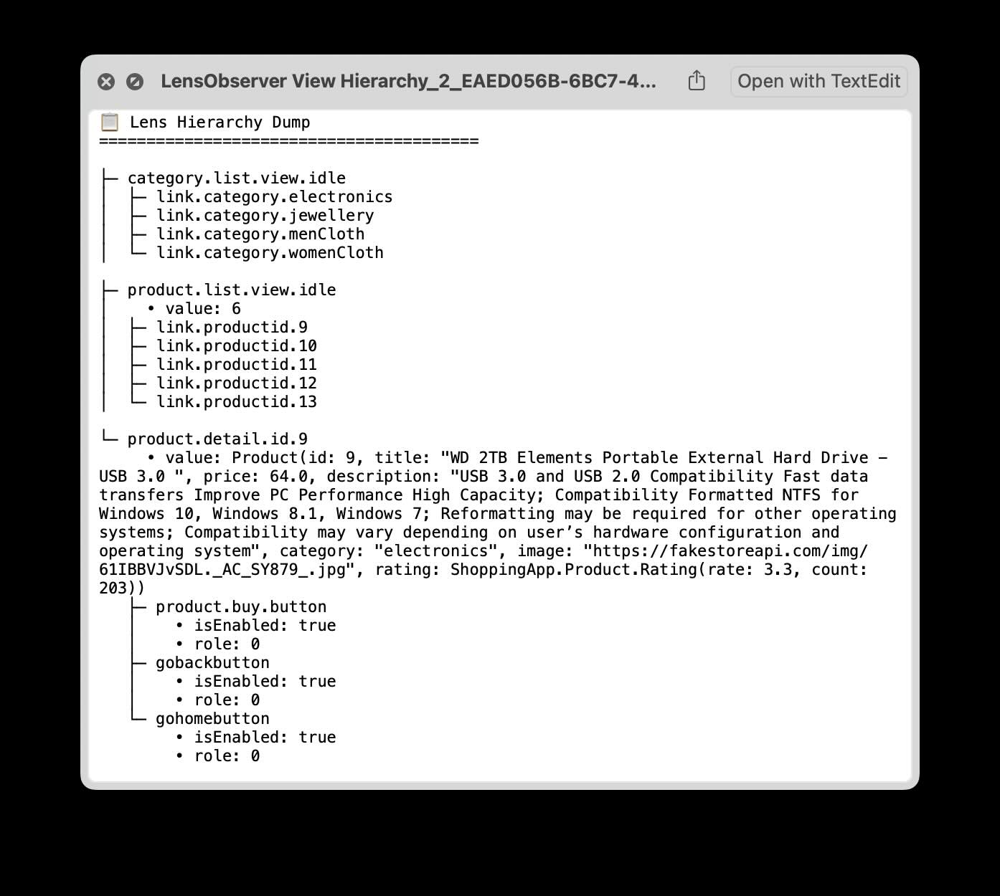

# 🛠 Debugging Test Failures in SwiftLens

SwiftLens supports powerful debugging tools for inspecting your SwiftUI view hierarchy and UI state **during tests** — with different behaviors depending on the test environment.

---

## 🚦 Overview

SwiftLens captures debug artefacts such as:

- 📸 **Screenshots** of the rendered SwiftUI hierarchy
- 🧩 **View hierarchy dumps** as `.plist` (for programmatic inspection)
- 📝 **Human-readable hierarchy dumps** as `.txt`

You can attach these automatically **when a test fails**, or manually at any point during a test.

---

## ✅ XCTest Environment (Xcode Test Navigator)

If you’re using **XCTest** or running tests in Xcode, SwiftLens uses `XCTAttachment` to include all debug artifacts **directly inside the test results**:

- Shown inline in the test navigator
- Easy to review after CI or local runs

### ✨ Attachments Include:

- `Screenshot.png`
- `LensObserver View Hierarchy.plist`
- `LensObserver View Hierarchy.txt`

```swift
sut.observer.saveSnapshotToDisk(name: "productlist.screen")
```

Open Xcode results navigator to view:







## 🧪 Swift-Testing Environment

If you’re using Swift's new [Testing framework](https://github.com/apple/swift-testing):

- Artifacts are written to the file system (usually `/tmp`)
- Console logs show where each file was saved


